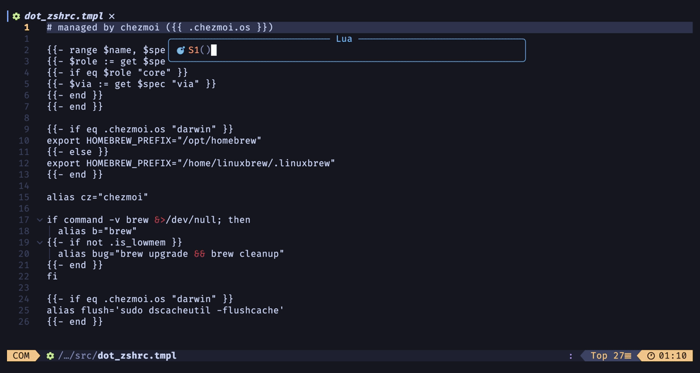
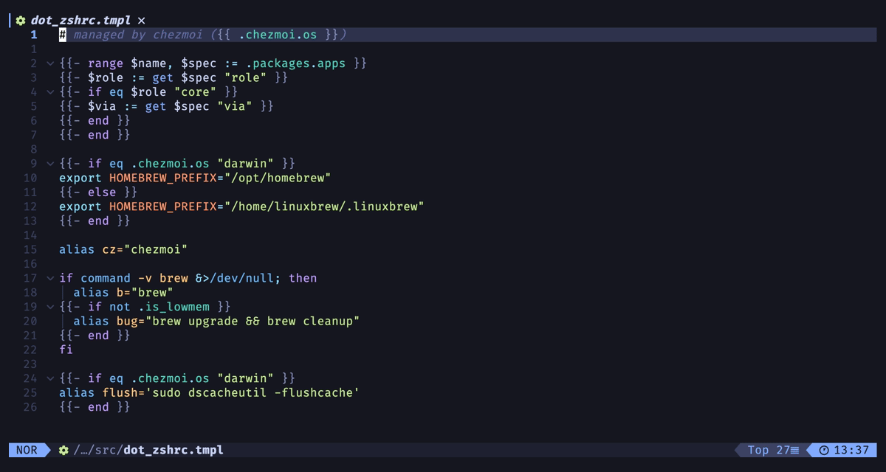
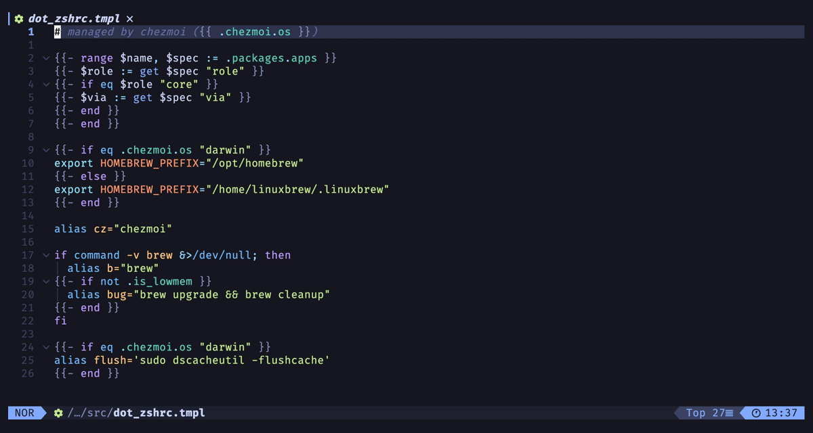
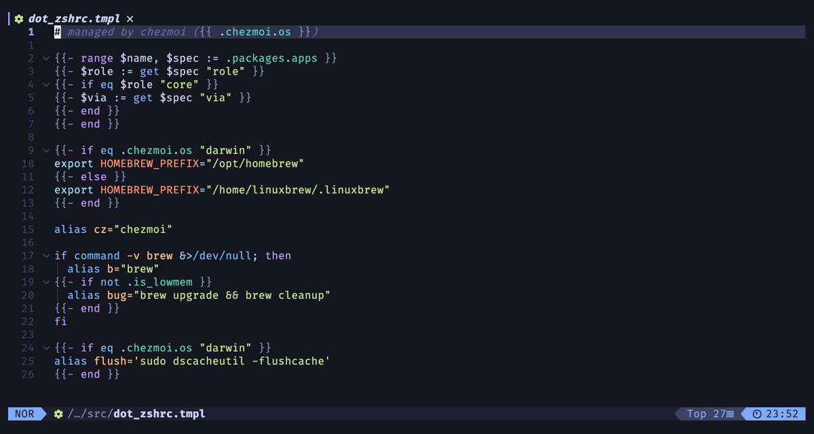
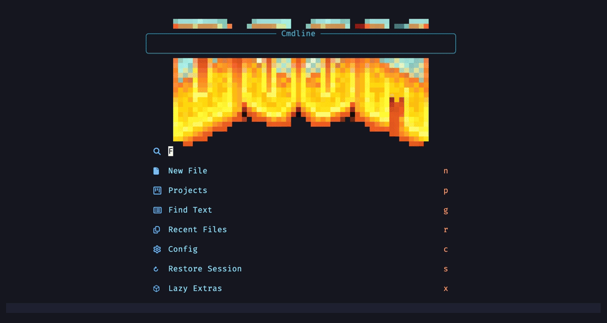

# chezmoi-template.nvim

[](https://github.com/dpezto/chezmoi-template.nvim/actions/workflows/ci.yml)
[](https://codecov.io/gh/dpezto/chezmoi-template.nvim)
[](LICENSE)

Edit your [chezmoi](https://chezmoi.io) source files **natively** — and make Neovim understand them.

Most chezmoi integrations wrap the `chezmoi edit` CLI: temporary buffers, watchers, apply-on-save. This plugin takes the opposite approach: you open the real source files (in `~/.local/share/chezmoi`, under git, with your normal workflow), and the editor becomes chezmoi-aware:

<!--toc:start-->

- [chezmoi-template.nvim](#chezmoi-templatenvim)
  - [Requirements](#requirements)
  - [Installation](#installation)
  - [Configuration](#configuration)
    - [Formatting](#formatting)
    - [Icons](#icons)
    - [Encryption](#encryption)
  - [Completion](#completion)
  - [Picker](#picker)
  - [Lua API](#lua-api)
  - [Secrets](#secrets)
  - [vs. chezmoi.nvim / chezmoi.vim / the LazyVim extra](#vs-chezmoinvim-chezmoivim-the-lazyvim-extra)
  - [Health](#health)
  - [Development](#development)

<!--toc:end-->



- **Real highlighting inside templates.** A `dot_zshrc.tmpl` is a `gotmpl` buffer whose text is treesitter-injected as **zsh** — Go-template syntax _and_ target-language syntax, simultaneously. Works for any target language with a treesitter parser, resolved via `chezmoi target-path`. Includes `.chezmoitemplates/` partials, `.chezmoiignore` / `.chezmoiremove` / `.chezmoiexternal.*`.
- **Format templates as their target filetype** ([conform.nvim](https://github.com/stevearc/conform.nvim)). Go-template spans are masked with structurally inert placeholders, the buffer is formatted with the target filetype's formatter (shfmt, biome, taplo, …), then the spans are restored — with `{{ end }}` / `{{ else }}` re-indented to pair with their opener, and column-0 `{{-` directive blocks getting depth-encoding interior padding:

  ```gotmpl
  {{- range $name, $spec := .packages.apps }}
  {{-   $roles := get $spec "role" }}
  {{-   if and $roleOK $osOK }}
  {{-     $via := get $spec "via" }}
  {{-   end }}
  {{- end }}
  ```

  

- **Target-aware icons** ([mini.icons](https://github.com/nvim-mini/mini.icons)). `private_dot_config/ghostty/config.tmpl` shows the ghostty icon, not a generic template glyph. Any combination of chezmoi source-state attributes (`private_`, `encrypted_`, `exact_`, `dot_`, `.tmpl`, `.age`, …) resolves to the deployed name.
- **Transparent encryption** (opt-in). chezmoi-managed `*.age` files decrypt on open and re-encrypt on save via `chezmoi decrypt` / `chezmoi encrypt` — whatever your chezmoi config uses (age, rage, builtin age, even gpg) just works. `encrypted_*.tmpl.age` still gets full template + target highlighting.
- **`%` matching for template delimiters** ([vim-matchup](https://github.com/andymass/vim-matchup)). `{{ if }}` ⇄ `{{ else }}` ⇄ `{{ end }}`, including `{{-` trim markers.
- **Live template preview.** `:Chezmoi preview` renders the buffer through `chezmoi execute-template` into a split (vertical by default, `preview.split = "horizontal"` to change) typed as the target filetype, re-rendered live as you type (debounced). Invalid syntax keeps the last valid render — flagged stale in the winbar — until it parses again. `q` (or toggling again) closes it.
- **Template diagnostics.** Errors from `chezmoi execute-template` surface as `vim.diagnostic` entries on write — template typos stop being invisible until apply fails.
- **Commands.** One `:Chezmoi` command with subcommands (tab-completed): `apply` (buffer target, or `:Chezmoi! apply` for all; apply-on-save on by default), `diff`, `target` (`:Chezmoi! target` opens the deployed file), `source` (jump from a deployed file to its source; opt-in automatic redirect), `edit` (`:Chezmoi edit <target>` opens the source for any deploy target, tab-completing target paths), `preview`, `pick` (source-file picker: snacks / telescope / fzf-lua / mini.pick / `vim.ui.select`).
- **Completion** ([blink.cmp](https://github.com/Saghen/blink.cmp)). Context-aware inside `{{ … }}` via the gotmpl treesitter tree: after a dot (`.foo`) it offers only data keys from `chezmoi data` (icons reflect each value's type, docs preview the value); at command position it adds template/sprig/chezmoi functions and Go template keywords; inside string literals it stays quiet. Outside actions: block snippets — `if`, `if/else`, `range`, `with`, `define`, `block`, comments — expanding to full `{{- … }}…{{- end }}` pairs. Falls back to a line heuristic when the gotmpl parser isn't installed.



Everything degrades gracefully: without the `chezmoi` binary you keep plain gotmpl highlighting and nothing errors.

## Requirements

- Neovim ≥ 0.10
- `chezmoi` on `$PATH` (optional, but the point)
- nvim-treesitter with the `gotmpl` parser (plus parsers for your target languages)

Everything else is per-feature and optional:

| Feature      | Needs                                                                                                                                                                  |
| ------------ | ---------------------------------------------------------------------------------------------------------------------------------------------------------------------- |
| Formatting   | [conform.nvim](https://github.com/stevearc/conform.nvim) + the target filetype's formatter                                                                             |
| Icons        | [mini.icons](https://github.com/nvim-mini/mini.icons)                                                                                                                  |
| `%` matching | [vim-matchup](https://github.com/andymass/vim-matchup)                                                                                                                 |
| Completion   | [blink.cmp](https://github.com/Saghen/blink.cmp) ≥ 0.13 (per-item kind icons/highlights); `markdown` + `markdown_inline` Tree-sitter parsers for type-highlighted docs |
| Picker       | any of snacks / telescope / fzf-lua / mini.pick — falls back to `vim.ui.select`                                                                                        |
| Encryption   | nothing extra — delegates to `chezmoi decrypt` / `chezmoi encrypt`, so chezmoi's own config drives age/rage/builtin/gpg                                                |

> Developed and tested on macOS, Linux, and Windows (CI). Every path is normalized through `vim.fs`, and the test suite runs on `windows-latest` alongside Linux. Windows support is newer than the Unix support, so reports are still welcome.

## Installation

lazy.nvim:

```lua
{
  "dpezto/chezmoi-template.nvim",
  lazy = false,
  ---@module 'chezmoi-template'
  ---@type chezmoi-template.Config
  opts = {},
}
```

The two annotation lines are optional — with [lazydev.nvim](https://github.com/folke/lazydev.nvim) (or lua_ls configured with the plugin on its library path) they give completion and type checking for every option in `opts`.

`lazy = false`, but startup stays cheap: `setup()` only registers filetype
detection, the treesitter directive, and light triggers — the heavy work (module
loads, autocmds) is deferred until the first template opens or a `:Chezmoi*`
command runs. So it costs ~nothing on sessions where you never touch a chezmoi
file, whether the plugin loads via `opts` or bare. Keep `lazy = false` — don't
set `ft`/`cmd`; the deferral is internal, and filetype detection must register at
startup for `.tmpl` files to be recognized.

The plugin bootstraps itself with defaults, so `setup()`/`opts` is only needed to
change options. With other plugin managers, install and optionally set
`vim.g.chezmoi_template = { ... }` before it loads. Releases are tagged (semver);
add `version = "*"` to the spec to pin to stable releases.

## Configuration

Defaults:

```lua
require("chezmoi-template").setup({
  source_dir = nil,            -- nil = auto-detect via `chezmoi source-path`
  inject = {
    enabled = true,            -- treesitter injection of the target language
    exclude = {},              -- lua patterns (matched on the normalized "/" path) to leave as plain gotmpl
  },
  format = {
    enabled = true,            -- conform formatter registration
    indent_directives = true,  -- depth-pad column-0 `{{-` directive blocks
  },
  icons  = { enabled = true }, -- mini.icons resolution (no-op if absent)
  apply = {
    on_save = true,            -- chezmoi apply <target> after writing a source file
    notify = true,             -- notify on successful applies (failures always notify)
    force = false,             -- pass --force (skip chezmoi's prompt on modified targets)
  },
  preview = {
    live = true,               -- :Chezmoi preview re-renders as you type (false = on write)
    debounce = 150,            -- ms of idle before a live re-render
    slow_ms = 500,             -- renders slower than this pause live preview to on-write; 0 disables
    split = "vertical",        -- preview window orientation: "vertical"|"horizontal"
  },
  notify_on_open = false,      -- notify when opening a managed source file
  redirect = false,            -- opening a deployed managed file jumps to its source
  diagnostics = { enabled = true },
  completion = {
    -- hide values of data keys matching these patterns in completion docs
    mask = { "secret", "token", "passw", "key", "api" },
  },
  picker = {
    backend = nil,             -- "snacks"|"telescope"|"fzf-lua"|"mini"|"select"; nil = auto
    display = "target",        -- entry labels: "target" (.zshrc) or "source" (dot_zshrc.tmpl)
    exclude = nil,             -- lua patterns to hide; nil = built-in internals list, {} = show all
  },
  encryption = {
    enabled = false,           -- opt-in; delegates to chezmoi decrypt/encrypt
    exclude = {},              -- lua patterns (matched on the normalized "/" path) for *.age paths to leave untouched
  },
})
```

### Formatting

The formatter is registered with conform as `chezmoi`, and `formatters_by_ft.gotmpl = { "chezmoi" }` is set if you haven't set it yourself. It formats using the **target filetype's** formatter, so that formatter must be installed and configured in conform as usual.

If you use the encryption module and format decrypted `*.age` buffers, route them through the `chezmoi` formatter too (it strips the `.age` suffix before handing the file to the underlying formatter):

```lua
-- in your conform opts, after defining formatters_by_ft
for ft, formatters in pairs(opts.formatters_by_ft) do
  if type(formatters) == "table" then
    opts.formatters_by_ft[ft] = function(bufnr)
      return vim.api.nvim_buf_get_name(bufnr):match("%.age$") and { "chezmoi" } or formatters
    end
  end
end
```

### Icons

mini.icons has no resolver hook, so the integration wraps `MiniIcons.get()` (transparently for non-chezmoi names). If you lazy-load mini.icons and icons don't resolve, call the attach explicitly from its `config`:

```lua
require("chezmoi-template.icons").attach()
```

For statusline/bufferline components, `require("chezmoi-template.icons").get(path)` returns the target's `glyph, hl` (or nil for non-chezmoi paths). lualine example:

```lua
local function file_icon()
  local icon, hl = require("chezmoi-template.icons").get(vim.api.nvim_buf_get_name(0))
  if not icon then
    return ""
  end
  return icon
end
```

### Encryption

Opt-in transparent editing of managed `*.age` / `*.asc` files: decrypt on read,
re-encrypt on write. Decrypt/encrypt delegate to `chezmoi decrypt` /
`chezmoi encrypt`, so identities, recipients, and tool choice — even gpg — all
come from chezmoi's own encryption config. Zero plugin config:

```lua
encryption = {
  enabled = true,
  exclude = { "private%-keys" }, -- e.g. passphrase-encrypted bootstrap keys
},
```

Decrypted content never hits disk (no swap, no undo file). `exclude` lua patterns
leave matching paths as plain binary — useful for passphrase-encrypted keys chezmoi
can't decrypt non-interactively.

## Completion



Requires blink.cmp ≥ 0.13 (per-item `kind_icon`/`kind_hl`). Register the source in your blink opts:

```lua
sources = {
  default = { "chezmoi", "lsp", "path", "buffer" },
  providers = {
    chezmoi = { name = "chezmoi", module = "chezmoi-template.blink" },
  },
}
```

The source only activates in gotmpl buffers. Inside `{{ … }}` it narrows by cursor position (treesitter-driven, with a line-regex fallback): data keys after a dot, plus functions and keywords at command position, and nothing inside string literals; elsewhere it offers block snippets (`if` → `{{- if … }}\n…\n{{- end }}` etc.), so it stays out of the way of the target language's own completion. Note: templates using secret-manager functions (`onepassword`, `vault`, …) may make `:Chezmoi preview`/diagnostics slow or fail without auth — those calls run whatever your template runs.

## Picker



`:Chezmoi pick` opens a file picker over the source directory. Entries are built by the plugin (via `git ls-files`, so the source repo's `.gitignore` is respected; plain fs walk for non-git source dirs), identically across backends:

- **Labels** show the deployed target name (`dot_zshrc.tmpl` → `.zshrc`); set `picker.display = "source"` for raw source names.
- **Chezmoi internals are hidden** by default (`.git/`, `.chezmoi.$FORMAT.tmpl`, `.chezmoiversion`, `.chezmoiroot`, `.chezmoidata.*`) while editable specials stay listed (`.chezmoiignore`, `.chezmoiscripts/`, `.chezmoitemplates/`, `.chezmoiexternal.*`). `picker.exclude` takes your own lua patterns (matched against the source-relative path) and replaces the built-in list; `{}` shows everything.
- **Preview highlights the target language** inside the template, same as opening the file.

Backend auto-detects among loaded pickers (snacks → telescope → fzf-lua → mini.pick) with a `vim.ui.select` fallback; if your picker is lazy-loaded it may not be detected — set `picker.backend = "telescope"` (etc.) explicitly (a plain string `picker = "telescope"` still works as shorthand). Map it however you like:

```lua
keys = { { "<leader>sz", "<cmd>Chezmoi pick<cr>", desc = "Chezmoi source files" } },
```

## Lua API

For statuslines, custom pickers, or scripts:

```lua
-- every managed file as { source = <abs>, target = <abs> } pairs
local files = require("chezmoi-template").list()

-- open the chezmoi source for a deploy target (~ is expanded)
require("chezmoi-template").edit("~/.zshrc")
```

`edit(target)` is the programmatic form of `:Chezmoi edit <target>`.

## Secrets

What the plugin does by itself:

- Decrypted buffers never persist plaintext: `swapfile`, `undofile` and swap are disabled, and writes go straight through `chezmoi encrypt` (no plaintext temp file).
- Completion docs hide values of data keys matching `completion.mask` (default: `secret`, `token`, `passw`, `key`, `api`) — the key still completes, the value shows as `•••••`.

What you should know:

- `:Chezmoi preview` and diagnostics run `chezmoi execute-template` on your buffer — templates calling secret managers (`onepassword`, `vault`, `pass`, …) will render real secrets into the preview split, and may be slow or fail without auth. Don't screen-share the preview of a secrets template.
- [cloak.nvim](https://github.com/laytan/cloak.nvim) composes well for masking secrets in decrypted buffers — its `file_pattern`s match the buffer name, which keeps its encrypted suffix: add `"*.age"`/`"*.asc"` (or specific names like `"*.json.age"`) to your cloak patterns.
- [ecolog.nvim](https://github.com/philosofonusus/ecolog.nvim) env completion works inside templates by mirroring its providers onto the `gotmpl` filetype; its shelter mode then masks env values in completion/peek as usual:

  ```lua
  -- ecolog opts.providers: reuse shell providers for gotmpl buffers
  providers = vim.tbl_map(function(p)
    return vim.tbl_extend("force", p, { filetype = "gotmpl" })
  end, shell_providers),
  ```

## vs. chezmoi.nvim / chezmoi.vim / the LazyVim extra

|                       | chezmoi.nvim + chezmoi.vim                  | chezmoi-template.nvim                                      |
| --------------------- | ------------------------------------------- | ---------------------------------------------------------- |
| Editing model         | wraps `chezmoi edit` (tmp buffers, watch)   | native source files                                        |
| Template highlighting | regex compound filetypes (`sh.chezmoitmpl`) | treesitter injection of the real target language           |
| Formatting            | —                                           | target-filetype formatting through templates               |
| Icons                 | static per-extension glyphs                 | full source-name → target resolution                       |
| age files             | —                                           | transparent decrypt/encrypt (opt-in)                       |
| Preview / diagnostics | —                                           | `:Chezmoi preview`, template errors as diagnostics         |
| Completion            | —                                           | data keys + template functions (blink.cmp)                 |
| Apply                 | apply-on-save via `chezmoi edit --watch`    | `:Chezmoi apply` + apply-on-save (default)                 |
| Picker                | telescope/fzf/snacks picker                 | `:Chezmoi pick` — snacks/telescope/fzf-lua/mini.pick/select |

## Health

`:checkhealth chezmoi-template` verifies the chezmoi binary, gotmpl parser, conform, and the encryption setup.

## Development

`make test` runs the test suite headless (no external formatter binaries needed — conform is stubbed). CI runs it on stable and nightly Neovim, plus a weekly cron against nightly to catch API drift.

`make smoke` exercises the plugin against a throwaway chezmoi setup deliberately unlike the author's — custom `sourceDir`/`destDir`, gpg encryption, and a run with no chezmoi config at all. Needs `chezmoi` (and optionally `gpg`) on `$PATH`; it never touches your real chezmoi state.

See [CONTRIBUTING](.github/CONTRIBUTING.md) for commit conventions and the AI-assistance policy.
